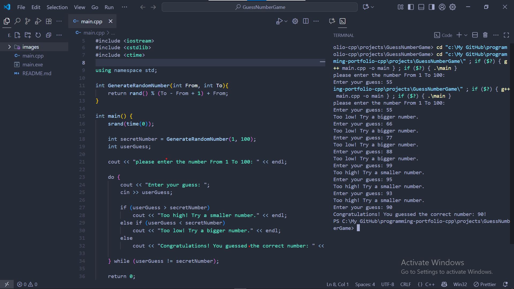

# Number Guessing Game (C++):

A simple console-based Number Guessing Game written in C++.  
The program generates a random number between 1 and 100, and the player has to guess it.  
After each guess, the program provides feedback:

🔼 Too high! → Guess a smaller number.  
🔽 Too low! → Guess a bigger number.  
✅ Correct! → You win!


## 🚀 Features:

- Random number generation within a range (1–100).  
- Continuous guessing until the correct number is found.  
- Friendly messages to guide the player.  
- Beginner-friendly C++ project to practice programming fundamentals.


## 📂 Project Structure:

Number-Guessing-Game/
┣ main.cpp # Source code of the game
┣ README.md # Project documentation
┗ images/ # Screenshots of the game output


## 🛠️ Technologies Used:

- **Language:** C++  
- **Libraries:**  
  - `cstdlib` (for rand())  
  - `ctime` (for seeding random numbers)


## ▶️ How to Run:

1. Clone the repository or copy the `main.cpp` file.  
2. Compile the code using any C++ compiler:

```bash
g++ main.cpp -o guessing_game

Run the program:

./guessing_game

Replace main.cpp with your actual filename if different.


 Example Output:





Example interaction:

Welcome to Guess Number Game!
Please enter a number from 1 to 100:

Enter your guess: 50
Too high! Try a smaller number.
Enter your guess: 25
Too low! Try a bigger number.
Enter your guess: 37
Congratulations! You guessed the correct number: 37!

💡 Future Improvements:

Add difficulty levels (Easy, Medium, Hard).
Limit the number of attempts.
Allow the user to play multiple rounds.
Add a scoring system.


👨‍💻 Author:
Mahmoud Elabsy.
